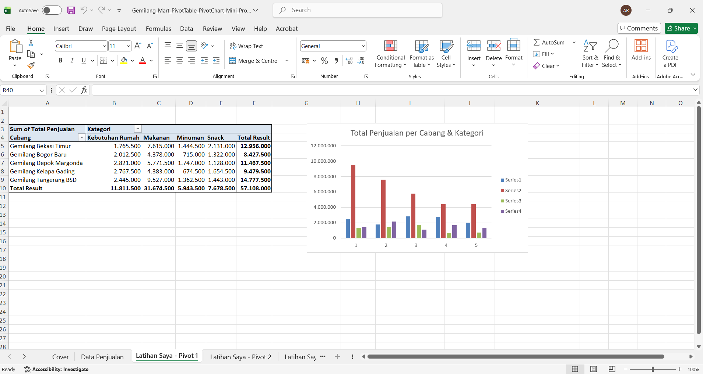
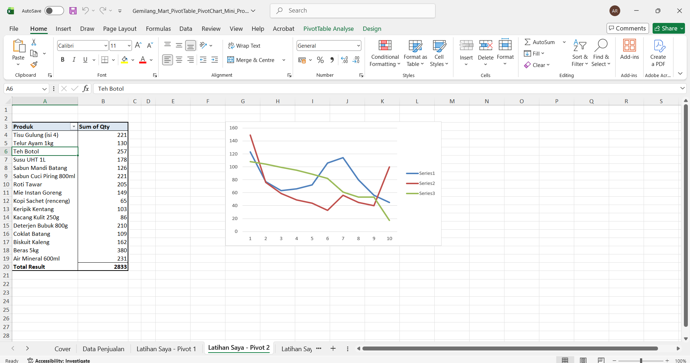
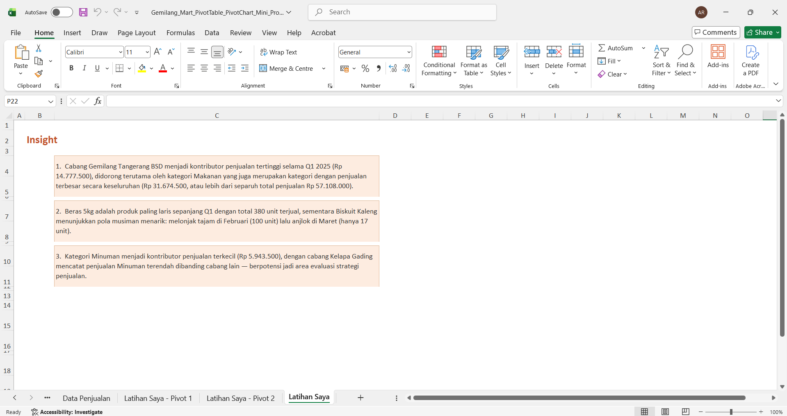

# Gemilang Mart — Q1 2025 Sales Analysis (PivotTable & PivotChart)

Mini data analysis project menggunakan **Microsoft Excel PivotTable & PivotChart** untuk menganalisis data penjualan Q1 2025 (Januari–Maret) dari 5 cabang minimarket fiktif di area Jabodetabek.

## 📌 Tentang Project

Gemilang Mart adalah minimarket fiktif dengan 5 cabang di Jabodetabek yang menjual kebutuhan sehari-hari (makanan, minuman, snack, kebutuhan rumah tangga). Project ini dibuat sebagai latihan untuk menguasai PivotTable dan PivotChart di Excel — mengolah data transaksi mentah menjadi laporan ringkas yang bisa langsung dibaca oleh manajemen toko.

- **Periode data:** Januari – Maret 2025 (Q1 2025)
- **Cakupan:** 5 cabang (Tangerang BSD, Bekasi Timur, Depok Margonda, Kelapa Gading, Bogor Baru), 4 kategori produk
- **Jumlah baris data:** 260 transaksi

## 🛠️ Tools

- Microsoft Excel — PivotTable, PivotChart, Slicer

## 📊 PivotTable 1 — Total Penjualan per Cabang & Kategori

Menampilkan total penjualan tiap cabang, dipecah per kategori produk (Makanan, Minuman, Snack, Kebutuhan Rumah), untuk mengetahui cabang mana yang paling laris dan kategori produk apa yang paling laku.

## 📊 PivotTable 2 — Produk Terlaris per Bulan

Menampilkan jumlah unit terjual (Qty) tiap produk per bulan (Jan–Mar), untuk melihat tren dan pola musiman penjualan produk dari waktu ke waktu.

## 💡 Key Insights

1. **Cabang Gemilang Tangerang BSD** menjadi kontributor penjualan tertinggi selama Q1 2025 (Rp 14.777.500), didorong terutama oleh kategori **Makanan** yang juga merupakan kategori dengan penjualan terbesar secara keseluruhan (Rp 31.674.500, atau lebih dari separuh total penjualan Rp 57.108.000).
2. **Beras 5kg** adalah produk paling laris sepanjang Q1 dengan total 380 unit terjual, sementara **Biskuit Kaleng** menunjukkan pola musiman menarik: melonjak tajam di Februari (100 unit) lalu anjlok di Maret (hanya 17 unit).
3. Kategori **Minuman** menjadi kontributor penjualan terkecil (Rp 5.943.500), dengan cabang **Kelapa Gading** mencatat penjualan Minuman terendah dibanding cabang lain — berpotensi jadi area evaluasi strategi penjualan.

## 📂 File

File Excel lengkap (data mentah + PivotTable + PivotChart) tersedia di repo ini:
[`Gemilang_Mart_PivotTable_PivotChart_Mini_Project.xlsx`](./Gemilang_Mart_PivotTable_PivotChart_Mini_Project.xlsx)

---

**Dibuat oleh:** Bima Maulana
[LinkedIn](https://linkedin.com/in/bima-maulana-id) · [GitHub](https://github.com/BimaaMaulana)
